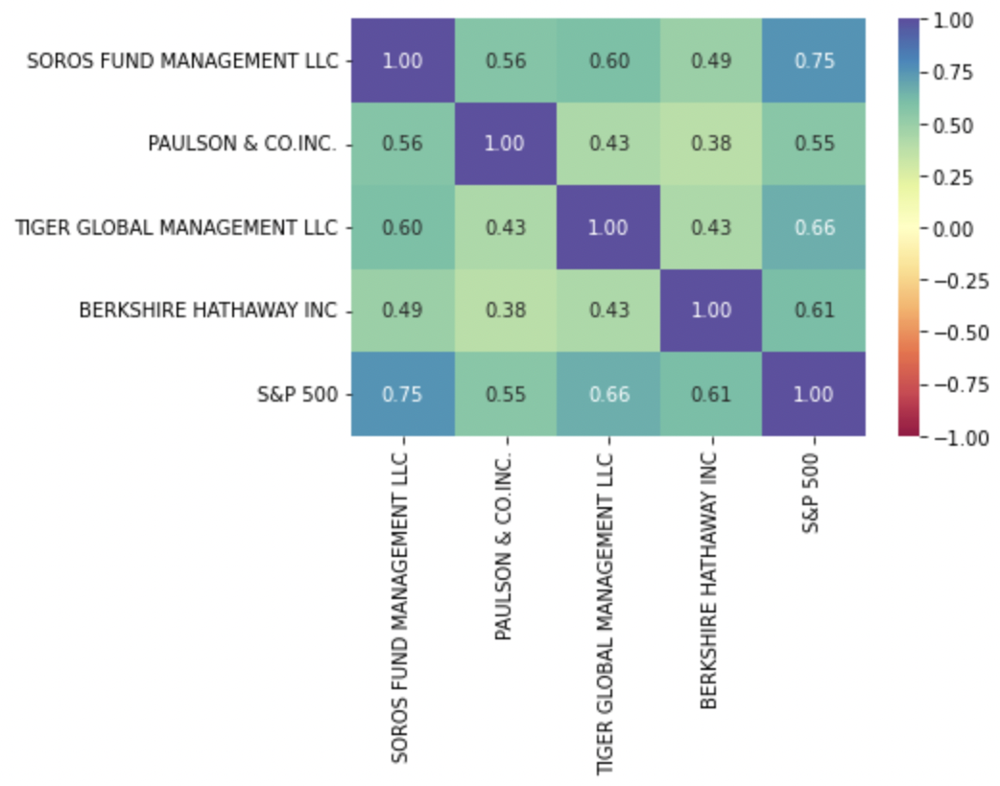
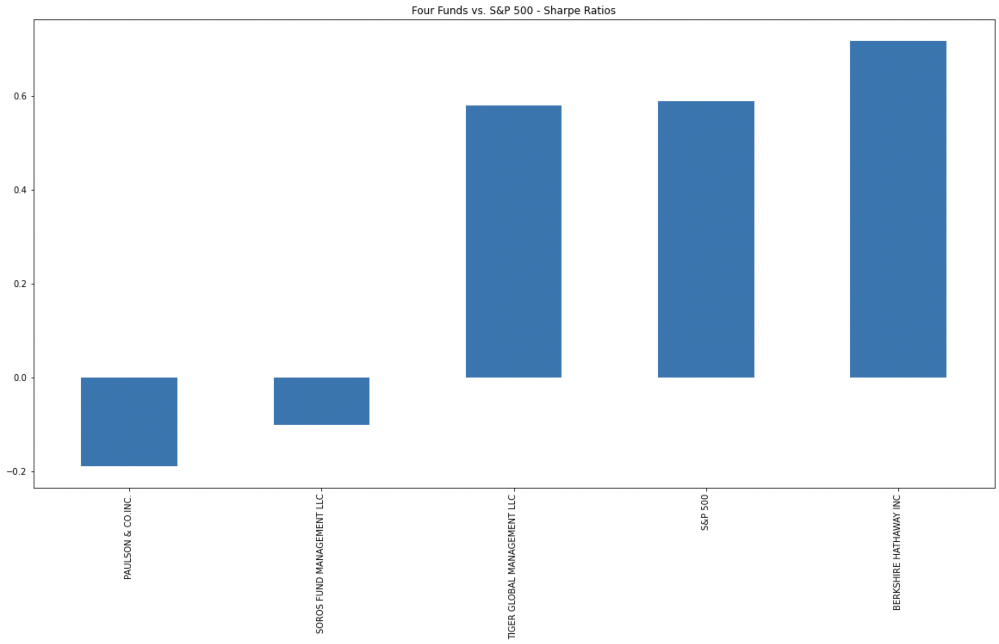
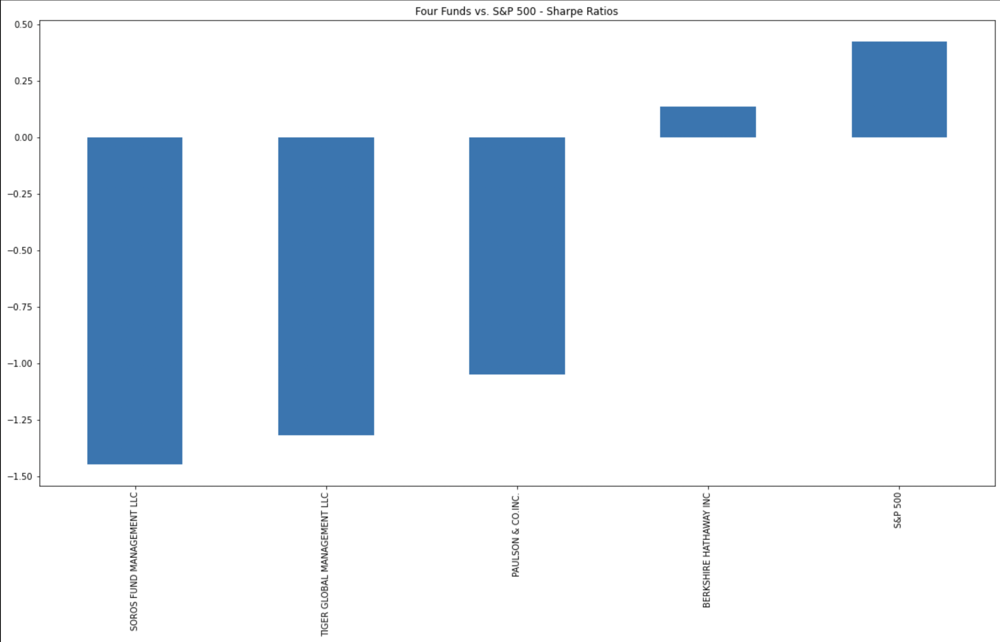
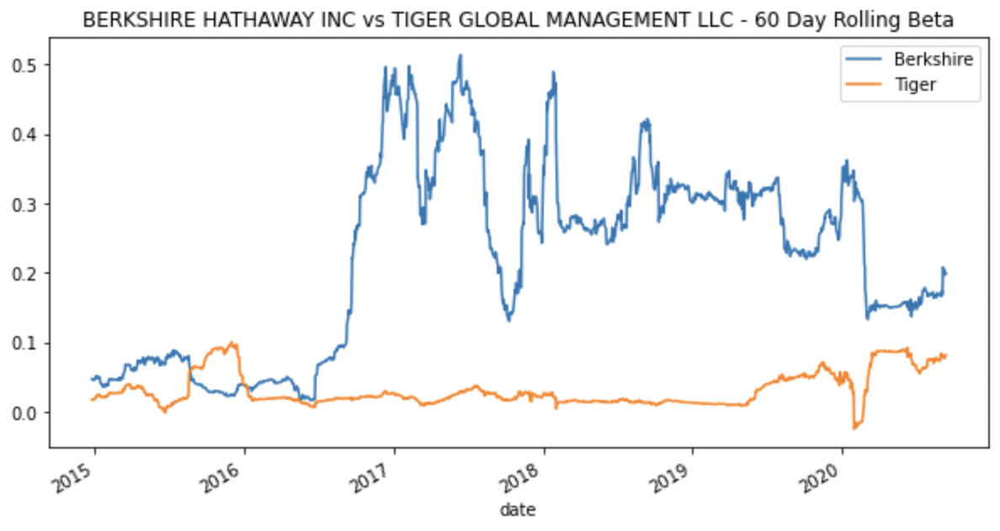
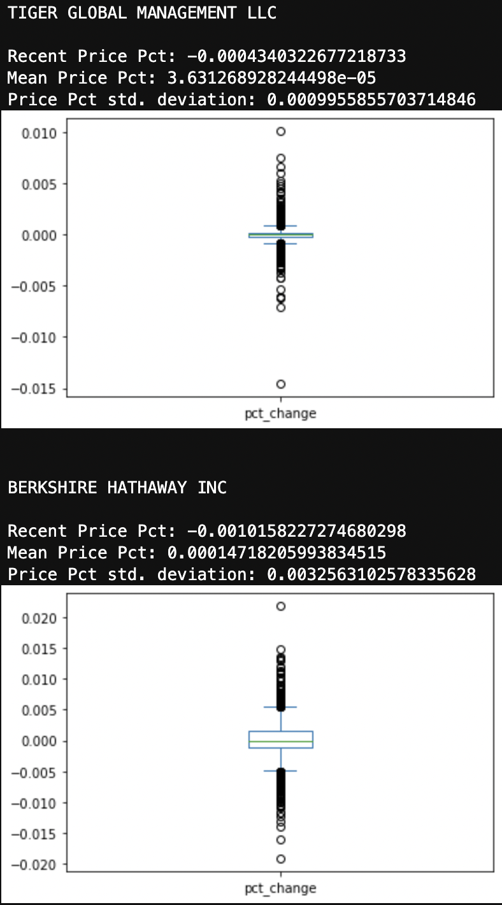
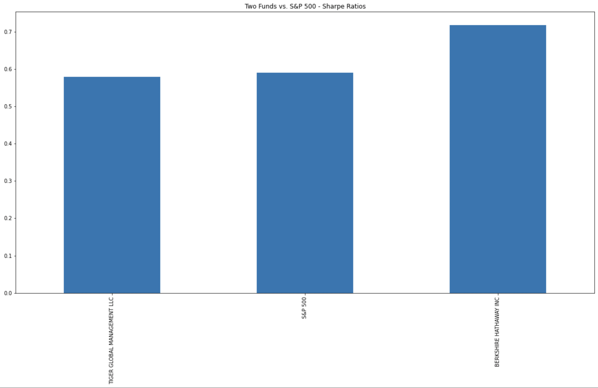
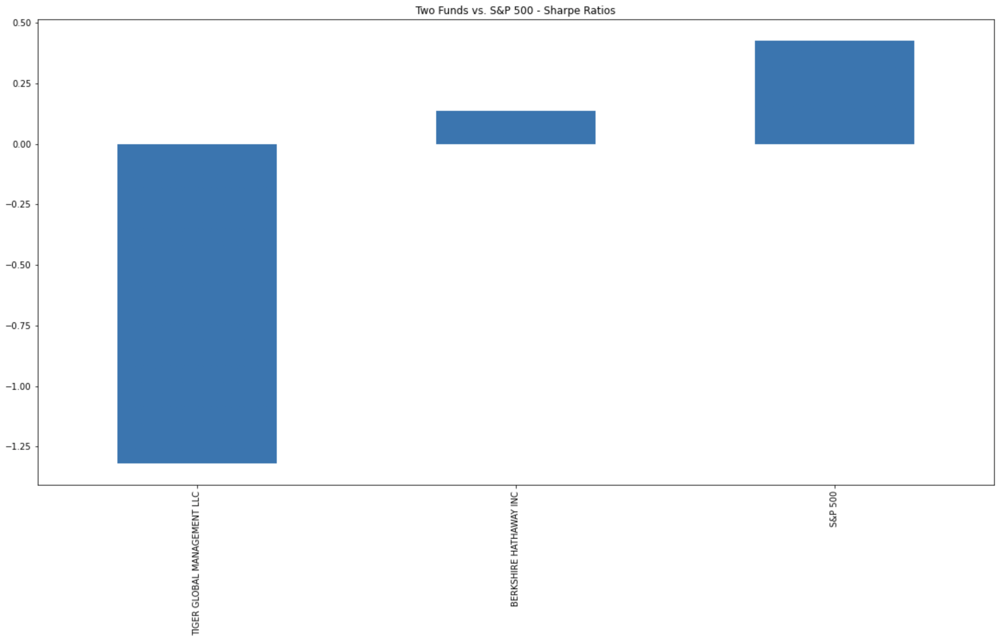
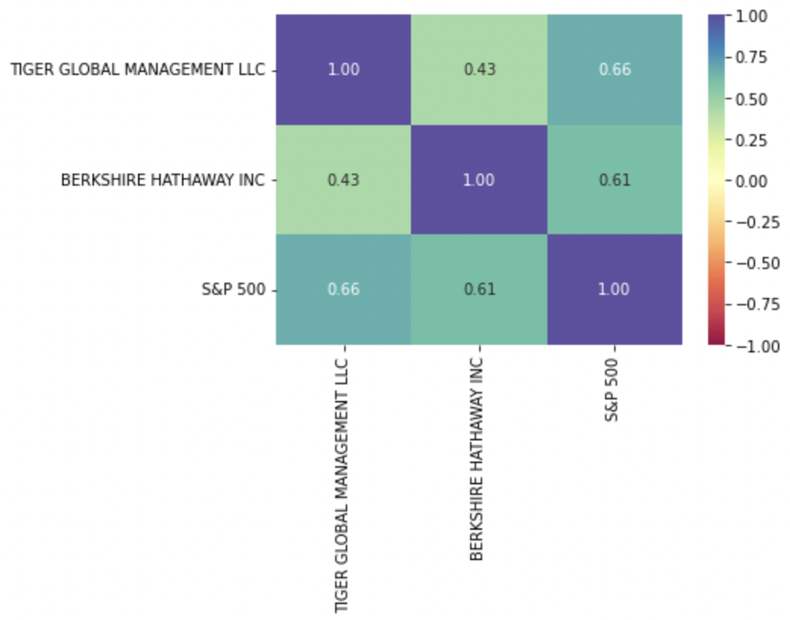

# **Columbia University Engineering, New York FinTech BootCamp** 
# **August 2022 Cohort**
## *Module 4, Challenge - Portfolio key risk management metrics & analysis*
### example analysis of key metrics: daily returns, standard deviations, Sharpe ratios, and betas


The purpose of this project was to assume the role of a quantitative analyst for a FinTech investing platform. The task at hand is to offer clients a one-stop online investment solution for their retirement portfolios that’s both inexpensive and high quality.

The goal is to systematically evaluate four new investment options (funds) for possible inclusion in the client portfolios. In so doing, determine the fund with the most investment potential based on key risk-management metrics: the daily returns, standard deviations, Sharpe ratios, and betas.

Beyond the scope of the assignment, the author sought to conduct additional analysis of the data obtained and demonstrate further visualization with combined data plots, overlay plots, and heatmap visualization.  Supplemental and/or extra analysis beyond the scope of the project is noted as 'supplemental' were approrpiate. 

---
## **Methods**

The code script analysis performed:
    
   Individually set path to CSV file called 'whale_navs.csv' from the Resources folder using the Path module.
   Use `read_csv` to read in csv file, generate dataframe setting the DatetimeIndex with 'date' as as index. 
   Set the parse_dates and infer_datetime_format parameters
    
        
   Individually prepare the dateframe by - 
   converting the dataframe of NAVs and prices to daily returns and
   cleaning missing and / or erroneous data using dropna() missing values.
   Review the first or last five rows of the DataFrame using `head()` or `tail()` functions.
        
   Quantitative analysis has several components: performance, volatility, risk, risk-return profile, and portfolio diversification.
   Daily returns were obtained with the Pandas `pct_change()` function together with `dropna()` to create the daily returns DataFrame. 
   Dataframe was then visualized with `plot()` function.  Cumulative returns are   generated with the Pandas `cumprod()` function. 
        
        `cumulative_returns = (1 + daily_returns).cumprod() - 1`
        
   Cumulative returns are then visualized with .plot() function.
   Volatility is visualized using daily return data to create box plots to visualize the volatility of the 4 funds and the S&P 500.
   The risk profile of each fund was analyzed using standard deviation and the beta.
  
### Mean
   - $\mu = \frac{\sum{x_{i}}}{n}$

The average value for a given `list` or `Series`


### Variance
   - ${S}^2 = \frac{\sum{ (x_{i} - \mu })^{2}}{ n - 1}$

The squared average change around the mean
 

### Standard deviation
  $\sigma = \sqrt{S^{2}}$

The square root of the variance
 
  
   The Pandas `std()` function is used to calculate the standard deviation for each of the four portfolios and for the S&P 500
   This was further analyzed via plot visualization of annualized and rolling 21-day values.
           
          `daily_returns_std = daily_returns.std()` 
          `annualized_std = daily_returns_std * np.sqrt(trade_days_year)`
          `daily_returns.rolling(window=21).std().plot()`
            
   SUPPLEMENTAL ANALYSIS was then introduced by the author.
   The `corr` function was used to calculate correlations for each fund pair.
   The `heatmap` function from the Seaborn library was used to create a heatmap of correlation values visualization.
   
    
   
   
   
   Additional information about the heatmap method from seaborn on the [documentation page](https://seaborn.pydata.org/generated/seaborn.heatmap.html#seaborn.heatmap).

   Using the `mean()` function, daily return DataFrame was used to calculate the annualized average return data for the four fund portfolios and for the S&P 500.

### Mean
   - $\mu = \frac{\sum{x_{i}}}{n}$


          `annual_average_returns = (daily_returns.mean()*trade_days_year)`


   Using the numpy `np.sqrt()` function, 252 trading day, and presumed risk-free return rate of zero, risk-return profile was then examined through calculating 
   the Sharpe ratios for the four fund portfolios and for the S&P 500.
   

 

          `sharpe_ratios = annual_average_returns / (daily_returns.std() * np.sqrt(trade_days_year))`
          
   The Sharpe ratios for the four funds and for the S&P 500 were then visualized in a bar chart


### Sharpe Ratio
   $\frac{R_{p}}{\sigma_{p}}$

The ratio between the average annual return and the annualized standard deviation (risk-free rate =0).  

     
   SUPPLEMENTAL ANALYSIS was then introduced by the author.
   comparitive analysis was conducted between Sharpe ratios based on risk free return rates (hurdle rate) being zero or 3% (0.03)
   These comparative Sharpe ratios for the four funds and for the S&P 500 were then visualized in a bar chart
   

### Sharpe Ratio
   $\frac{R_{p}-R_{f}}{\sigma_{p}}$

The ratio between the annual average return minus risk free rate of return and the annualized standard deviation; includes a significant risk free return rate 3%
   
   
        
   At this point, two funds were selected for continuation of analysis as greatest potential candidates.
   The Pandas `var()` function was used to calculate the variance of the S&P 500 by using a 60-day rolling window
   for the two selected funds, covariance was calculated using the 60-day rolling window, the daily return data, and the S&P 500 returns.
### Variance
   - ${S}^2 = \frac{\sum{ (x_{i} - \mu })^{2}}{ n - 1}$            
            
   Review the last five rows of the covariance of the funds was performed with `tail()` function.  The beta of each fund was calculated by division of
   the covariance of each fund by the variance of the S&P 500. The Pandas `mean()` function was used to calculate the average value of the 60-day rolling 
   beta of the funds.
    
   At this point the primary required analysis was complete.  The author then conduct some additional supplemental calculations for visualization.  
   Examples are demonstrated below. 


### combined/overlay rolling-beta for direct comparative analysis through visualization


### raw preliminary summary report data for direct comparative analysis through visualization


### Sharpe Ratios, presumes risk-free return rate = zero


### Sharpe Ratios, presumes risk-free return rate = 3% (o.o3)


### Heatmap, for direct comparative analysis through visualization of correlation
  

---
## **Technologies**
---
### **Dependencies**

This project leverages Jupyter Lab v3.4.4 and python v3.7 with the following packages:

* [Path](https://docs.python.org/3/library/pathlib.html?highlight=path#module-pathlib) - From 'pathlib', Object-oriented filesystem paths, used to identify a file

* [pandas](https://pandas.pydata.org/docs/) - Software library written for the Python programming language for data manipulation and analysis.

* [read_csv](https://pandas.pydata.org/docs/reference/api/pandas.read_csv.html?highlight=read_csv#) - From 'pandas', read a comma-separated values (csv) file into DataFrame

For additional and / or supplemental processing and visulaization this project also makes use of the following packages:

* [DataFrame](https://pandas.pydata.org/docs/reference/api/pandas.DataFrame.html?highlight=dataframe#pandas.DataFrame) - From 'pandas', to construct a dataframe, i.e. a two-dimensional, size-mutable, potentially heterogeneous tabular data

* [MinMaxScaler](https://pandas.pydata.org/docs/) - from sklearn, preprocessing package provides several common utility functions and transformer classes to change raw feature vectors into a representation that is more suitable for the downstream estimators, transforms features by scaling each feature to a given range.


### **Hardware used for development**

MacBook Pro (16-inch, 2021)

    Chip Appple M1 Max
    macOS Monterey version 12.5.1

### **Development Software**

Homebrew 3.5.10

    Homebrew/homebrew-core (git revision 0b6b6d9004e; last commit 2022-08-30)
    Homebrew/homebrew-cask (git revision 63ae652861; last commit 2022-08-30)

anaconda Command line client 1.10.0

    conda 4.13.0
    Python 3.7.13

pip 22.1.2 from /opt/anaconda3/envs/dev/lib/python3.7/site-packages/pip (python 3.7)


git version 2.37.2

---
## *Installation of application (i.e. github clone)*

 In the terminal, navigate to directory where you want to install this application from the repository and enter the following command

```python
git clone git@github.com:Billie-LS/FinTech_Homeworks.git
```

---
## **Usage**

From terminal, the installed application is run through jupyter lab web-based interactive development environment (IDE) interface by typing at prompt:

```python
  > jupyter lab
```

---
## **Project requirements**
### see starter code


---
## **Version control**

Version control can be reviewed at:

```python
https://github.com/Billie-LS/FinTech_Homeworks/tree/homework3
```

[repository](https://github.com/Billie-LS/FinTech_Homeworks/tree/homework3)


---
## **Contributors**

### **Author**

Loki 'billie' Skylizard

   [LinkedIn](https://www.linkedin.com/in/l-s-6a0316244)

   [@GitHub](https://github.com/Billie-LS)


### **BootCamp lead instructor**

Vinicio De Sola
[@GitHub](https://github.com/penpen86)


### **BootCamp teaching assistants**

Corey Recai

Santiago Pedemonte
[@GitHub](https://github.com/Santiago-Pedemonte)


---
## **License**

MIT License

Copyright (c) [2022] [Loki 'billie' Skylizard]

Permission is hereby granted, free of charge, to any person obtaining a copy
of this software and associated documentation files (the "Software"), to deal
in the Software without restriction, including without limitation the rights
to use, copy, modify, merge, publish, distribute, sublicense, and/or sell
copies of the Software, and to permit persons to whom the Software is
furnished to do so, subject to the following conditions:

The above copyright notice and this permission notice shall be included in all
copies or substantial portions of the Software.

THE SOFTWARE IS PROVIDED "AS IS", WITHOUT WARRANTY OF ANY KIND, EXPRESS OR
IMPLIED, INCLUDING BUT NOT LIMITED TO THE WARRANTIES OF MERCHANTABILITY,
FITNESS FOR A PARTICULAR PURPOSE AND NONINFRINGEMENT. IN NO EVENT SHALL THE
AUTHORS OR COPYRIGHT HOLDERS BE LIABLE FOR ANY CLAIM, DAMAGES OR OTHER
LIABILITY, WHETHER IN AN ACTION OF CONTRACT, TORT OR OTHERWISE, ARISING FROM,
OUT OF OR IN CONNECTION WITH THE SOFTWARE OR THE USE OR OTHER DEALINGS IN THE
SOFTWARE.


